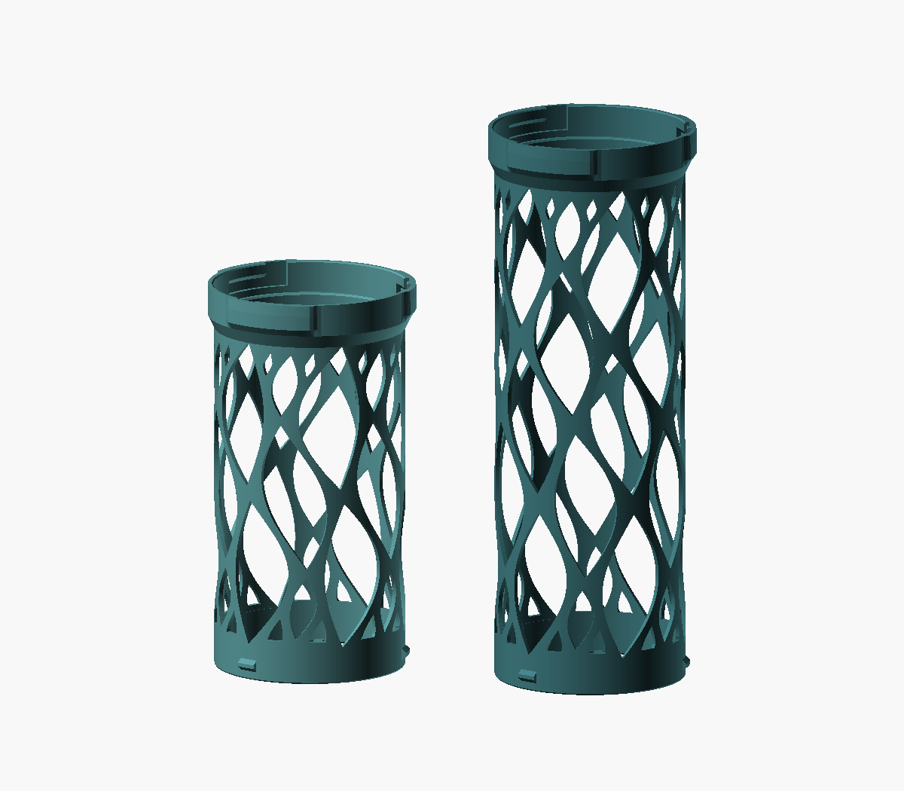
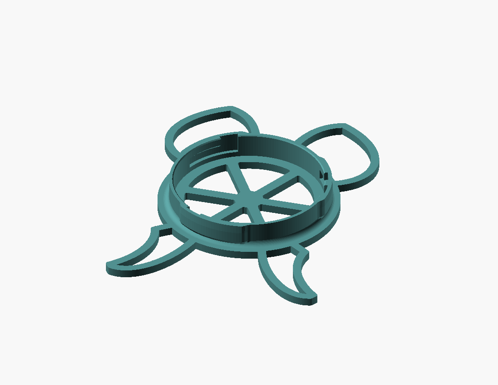

# Form and pattern

The user's preference is for useful prints that can also be interesting and aesthetically pleasing. Function fixes the necessary contacts, clearances, capacity, and load requirements; the surrounding form often has more freedom. Consider a flowing frame, a branched support, a folded shell, shaped openings, or a different arrangement of the same functional elements when it improves the object. Aesthetic value can justify a design choice in its own right.

## Can Tower leaf lattice precedent

Reviewed against the local project on 2026-10-08. These unchanged CAD renders are reference snapshots of the lightweight tube variants and base, not photographs or evidence of physical performance.

| Design choice in the project | Reusable principle |
| --- | --- |
| Leaf openings follow the cylindrical wall and share a gentle S-shaped sweep. Staggered rows form a continuous flowing network. | Shape the negative space and remaining material together on the actual surface. Coordinate neighbouring cells so the intervening webs have an intentional shape. |
| Large leaves establish the rhythm; smaller leaves and half leaves fill selected end regions. | Vary scale to resolve transitions and broad patches while preserving adequate material. Leave solid material where the interface or load needs it. |
| Full bands meet the coupling collars, with separate control of lattice wall thickness and mating geometry. | Keep functional interfaces stable while exploring the visible body. Parameterize those roles independently. |
| Leaf-shaped feet repeat the tube's visual vocabulary. Their outline includes recesses for neighbouring bases in an alternating nesting arrangement. | Let the motif influence the silhouette, footprint, and relationship between objects. Check stability and clearance as the outline changes. |
| Rounded roots and tips, continuous rims, and an open floor with a hub and spokes carry the idea into smaller details. | Resolve how the pattern ends, joins, and meets the user as carefully as its repeated middle. |

The project is a source of design reasoning and adaptable geometry. Future builds can use a different motif, cell arrangement, curvature, or overall form. Do not copy its wall thickness, leaf dimensions, or clearances as general PLA recommendations.

### Source and validation boundaries

- Original Can Tower source (`can-tower.scad`, separate design project, not bundled here): `flow_angle`, `leaf_halfwidth`, `leaf_cut`, `half_leaf_cut`, and `lattice` define the tube pattern; `planar_leaf`, the `foot_*` modules, and `base` define the feet and floor. Reuse with their parameter dependencies and checks, or adapt the construction explicitly.
- Original project notes (`README.md`, not bundled here): at the snapshot date, they recorded a successful connector fit, while full assembly and load testing remained outstanding. Consult that project's current notes, when available, before making build-specific claims. The saved images came from `previews/lightweight-lengths.png` and `previews/lightweight-base.png`.

The source checks the narrowest intervening webs, roof slopes, and the solid bridges between aligned leaf tips. Checking only adjacent staggered rows can miss a slit where tips in every second row merge. Smaller end openings need their own clearance checks. After adapting parameters or changing the surface, recompute these conditions and inspect the final mesh and toolpaths. A smooth or organic appearance does not demonstrate a structurally optimized load path.

## Apply the approach to a new build

Identify what must stay fixed and what is free to move or change shape. Explore the overall form early: a broad plate might become several curved arms, a rectangular wall might become an arched frame, or a dense shell might become a ribbed surface. Retain required containment, touch surfaces, and access.

Choose a related family of curves or shapes and decide how it varies across the object. Parameterize member thickness, opening size, spacing, sweep or taper, and interface margins separately. Avoid filling every remaining patch with a hole simply to increase open area. Inspect both the outside silhouette and the view through the structure.

When the form is still open and alternatives would help, use [labelled concept views](../../print-build-communication/SKILL.md#compare-form-concepts) to compare meaningfully different structures. Explain what gives each its character and the practical tradeoffs. A routine fit correction does not need a new concept exercise.

Then apply the [lightweight structure checks](lightweight-structures.md): continuous members, printable openings, sound junctions, retained interfaces, and relevant physical samples. Compare complete sliced material use before claiming savings; the Can Tower's overall savings also involved length, wall, collar, and floor changes, so they cannot be attributed to the leaf pattern alone.
